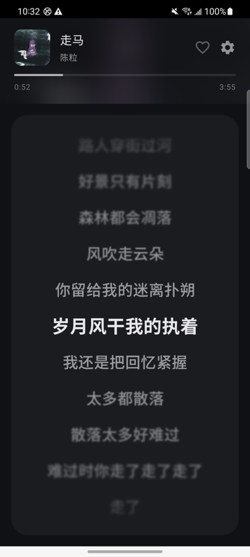
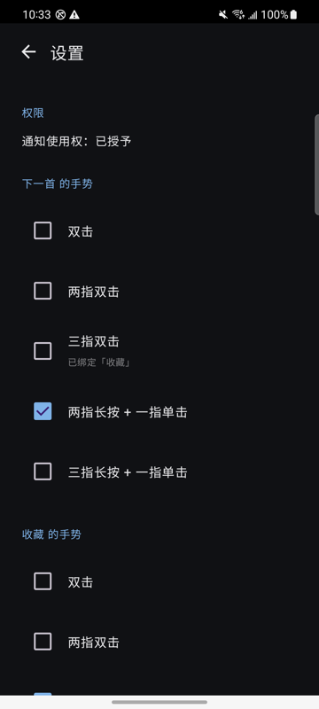

<div align="center">

# nudge

**把整个屏幕当作触控板，不看屏幕也能切歌和收藏。**

[](https://github.com/Mopip77/nudge/releases)
[](LICENSE)
[](https://github.com/Mopip77/nudge/releases)
[](https://kotlinlang.org)

</div>

---

nudge 是一个 Android 音乐控制 app，核心场景是**盲操**——手机在兜里、握在手上或屏幕朝下时，用不易误触的多指复合手势控制播放，全程不需要看屏幕，靠震动确认结果。

<div align="center">
  
  
</div>

## 特性

- **盲操手势** — 多指复合手势，为「看不见屏幕」设计，日常握持不会误触
- **震动反馈** — 每种结果的震动模式不同，不看屏幕也知道发生了什么
- **实时歌词** — Apple Music 观感的滚动歌词，景深模糊 + 边缘淡出，可关闭
- **三档灵敏度** — 在「容易触发」和「不易误触」之间按手感选择
- **手势可改绑** — 五种手势自由绑定到动作，冲突时有提示
- **配置预设** — 把全部配置存成最多三个命名预设，可一键切回，也能由外部自动化切换
- **Home Assistant 联动** — 通过 Companion 广播调用切歌、播放/暂停和点赞，无需 root

首版支持两个动作：**下一首** 和 **网易云收藏（红心）**。

## 安装

到 [Releases](https://github.com/Mopip77/nudge/releases) 下载最新的 `nudge-<版本>.apk` 安装。

要求 Android 8.0（API 26）及以上。

装好后可在**设置 → 关于 → 检查更新**里直接升级，不必再回来手动下载。

## 使用

1. 打开 app，按提示授予**通知使用权**（设置 → 通知 → 通知使用权 → 允许 nudge）。
   没有这个权限时「下一首」会降级为发送媒体按键（仍可用，但无法指定目标应用），「收藏」完全不可用。
2. 播放音乐，回到 nudge 主界面。
3. 在屏幕任意位置做手势。

### 默认手势

| 手势 | 动作 |
|---|---|
| 两指双击 | 下一首 |
| 三指双击 | 收藏 |

可在设置页改绑，同一手势不能同时绑给两个动作。可选手势还有：单指双击、两指长按 + 一指单击、三指长按 + 一指单击。

> 「长按 + 一指单击」的真实语义是「先放上 N 根手指作为底座，再用另一根手指点一下」。底座不需要刻意按住很久，只要处于按下状态即可。按住底座可以连续点击触发多次。

### 震动反馈

盲操下看不到屏幕，震动是确认结果的唯一渠道，因此每种结果的震动都不同：

| 结果 | 震动 |
|---|---|
| 切歌成功 | 单次短震（50ms） |
| 收藏成功 | 双震 |
| 本来就已收藏 | 极短震（20ms） |
| 失败 / 无播放会话 | 长震（200ms） |

### 灵敏度

三档（宽松 / 标准 / 严格），调整双击间隔、多指同时性窗口、移动容差等阈值。越严格越难误触，也越难触发。默认标准档。

### 配置预设

设置页顶部的**预设**区块有三个槽位，每个槽位保存一份完整配置（手势绑定、灵敏度、
主题、歌词开关、固定屏幕），可自定义名字。

- **保存 / 覆盖** — 把当前配置写入槽位。覆盖已有预设需二次确认
- **加载** — 用预设覆盖当前配置，立即生效
- **删除** — 清空槽位，需二次确认

加载后再改配置不会写回预设——预设只在你点「覆盖」时才更新，不会被误改污染。

外部自动化工具可用广播切换预设，`slot` 取 `1`/`2`/`3`：

```bash
adb shell am broadcast -a com.nudge.app.PROFILE -p com.nudge.app --es slot 2
```

空槽位和非法槽位号都不做任何操作，可用 `adb logcat -s NudgeProfileCommand` 排查。
和媒体广播一样，nudge 界面无需保持前台。

三星「模式与日常安排」不支持直接调用第三方应用的自定义动作（只能「打开应用」），
需经 Tasker 或 MacroDroid 中转：让 M&R 的模式触发这些工具的任务，由它们发送上述广播。
刻意不做 deep link 入口——那会把 nudge 弹到前台，开车时突然全屏触摸板并不安全。

### 检查更新

设置页底部「关于」里点**检查更新**，会查询本仓库的最新 Release。有新版时显示版本号和更新日志，点「立即更新」在应用内下载 APK 并拉起系统安装器。

只在手动点击时检查，启动时不会打扰。首次更新需要在系统弹出的页面里给 nudge 开启「安装未知应用」权限。

### Home Assistant 调用

链路：HA → 安卓 Companion → nudge → 音乐播放器。使用 Companion 官方支持的
[`command_broadcast_intent`](https://companion.home-assistant.io/docs/notifications/notification-commands/#broadcast-intent)。
安装支持此入口的 nudge 版本后先打开一次，并授予 nudge **通知使用权**；播放音乐后即可调用，nudge 界面无需保持前台。
系统设置里的「强行停止」会阻止广播接收，需要重新打开 nudge。

下一首（将 `notify.mobile_app_s20` 换成你的手机通知服务）：

```yaml
action: notify.mobile_app_s20
data:
  message: command_broadcast_intent
  data:
    intent_package_name: com.nudge.app
    intent_action: com.nudge.app.MEDIA
    intent_extras: "command:next"
```

点赞当前网易云歌曲：

```yaml
action: notify.mobile_app_s20
data:
  message: command_broadcast_intent
  data:
    intent_package_name: com.nudge.app
    intent_action: com.nudge.app.MEDIA
    intent_extras: "command:like"
```

广播支持以下命令，只需替换 `intent_extras` 中 `command:` 后的值：

| 命令 | 动作 |
|---|---|
| `next` | 下一首 |
| `previous` | 上一首 |
| `play` | 播放 / 恢复播放 |
| `pause` | 暂停 |
| `play_pause` | 播放和暂停之间切换 |
| `like` | 网易云点赞，已收藏时不取消 |

播放控制成功发送后短震一次。播放和切换操作在没有网易云、也没有正在播放的会话时，
会尝试暂停中的其他播放器。自动化中需要确定状态时使用 `play` 或 `pause`；
`play_pause` 每次切换一次，重复请求会再次切换。

`next` 和 `like` 复用手势动作及震动反馈，不受手势改绑影响。`like` 会先检查红心，已收藏时不操作，
不会主动取消收藏；下一首优先网易云，无网易云会话时控制正在播放的其他应用。
没有通知使用权时播放控制仍可尝试完整媒体按键，点赞不可用。未知或缺失的 `command` 会被忽略。

这是对本机应用开放的广播入口，其他应用也能调用这些固定动作。HA 的发送结果仅表示命令发送，
不代表播放器已完成操作；可通过震动、播放器状态或 `adb logcat -s NudgeMediaCommand` 排查。
日志里的 `Skipped` / `Liked` / `PlaybackCommandSent` 表示已向播放器发出操作，未等待播放器确认。

本地验证可使用相同的包名限定广播：

```bash
adb shell am broadcast -a com.nudge.app.MEDIA -p com.nudge.app --es command next
adb shell am broadcast -a com.nudge.app.MEDIA -p com.nudge.app --es command like
```

### 从电脑通过 HA API 快速调用

使用 HA REST API，将 `Bearer ` 后补上自己的 token，并替换 HA 地址和手机服务名。

下一首：

```bash
curl --fail-with-body -X POST 'https://your-ha.example.com/api/services/notify/mobile_app_s20' \
  -H 'Authorization: Bearer ' \
  -H 'Content-Type: application/json' \
  -d '{"message":"command_broadcast_intent","data":{"intent_package_name":"com.nudge.app","intent_action":"com.nudge.app.MEDIA","intent_extras":"command:next","priority":"high","ttl":0}}'
```

点赞：

```bash
curl --fail-with-body -X POST 'https://your-ha.example.com/api/services/notify/mobile_app_s20' \
  -H 'Authorization: Bearer ' \
  -H 'Content-Type: application/json' \
  -d '{"message":"command_broadcast_intent","data":{"intent_package_name":"com.nudge.app","intent_action":"com.nudge.app.MEDIA","intent_extras":"command:like","priority":"high","ttl":0}}'
```

上一首、播放/暂停切换可沿用同一 curl，将 `intent_extras` 分别改为
`command:previous`、`command:play_pause`；明确播放或暂停用 `command:play`、`command:pause`。

日常调用无需 USB 或 ADB。API 成功响应仅代表 HA 接受调用，播放器执行结果需在手机端确认。
`ttl: 0` 避免离线命令积压后执行；请求超时时先检查手机状态，避免重试导致连跳两首。

## 兼容性

| 功能 | 支持范围 |
|---|---|
| 下一首 | 任意音乐应用。优先控制网易云，网易云无活跃会话时控制第一个正在播放的应用 |
| 收藏 | **仅网易云音乐**。各家播放器的收藏实现不同，需要逐个适配 |
| 歌词 | 来自网易云公开接口，纯音乐或无歌词时不显示 |

在三星 SM-G9810 / Android 13 + 网易云 9.5.95 上实测通过。

## 开发

### 环境

- JDK 17（项目要求，注意系统默认 JDK 可能是别的版本）
- 无需预装 Gradle，用仓库内的 wrapper 即可
- Android SDK（`local.properties` 里配 `sdk.dir`）

### 构建

```bash
export JAVA_HOME=/opt/homebrew/opt/openjdk@17   # 按你的实际路径改

./gradlew assembleDebug    # debug 包
./gradlew test             # 单元测试
```

`assembleRelease` 在本地不带签名配置时会产出 unsigned APK（装不上），正式包由 CI 出。

### 架构

```
TrackpadScreen / SettingsScreen  (Compose)
        │ MotionEvent
GestureRecognizer  ──► Gesture         ConfigStore (DataStore)
        │                                   ▲── ProfileCodec (预设 JSON)
        │                                   ▲── ProfileCommandReceiver ◄── Tasker / 三星模式
ActionDispatcher  ──► Vibrator
        ▲── MediaCommandReceiver ◄── HA Companion / 本机广播
        │
MediaControlRepository ──► NotificationListenerService → MediaSessionManager
                           回退: AudioManager.dispatchMediaKeyEvent
```

`GestureRecognizer` 是纯 Kotlin 状态机，不依赖任何 Android 类，因此能在 JVM 上直接单元测试——多指手势的边界条件太多，靠真机手测不现实。

### 发布

推一个 `v` 开头的 tag 即可，GitHub Actions 会自动构建签名 APK 并发布到 Release：

```bash
git tag v1.2.3
git push origin v1.2.3
```

`versionName` 取 tag 去掉 `v` 前缀，`versionCode` 取 workflow 的运行序号。

签名依赖四个仓库 Secret：`KEYSTORE_BASE64`、`KEYSTORE_PASSWORD`、`KEY_ALIAS`、`KEY_PASSWORD`。缺失时 CI 会直接失败，不会发出未签名的包。

> ⚠️ keystore 必须离线备份。丢失后无法再为 `com.nudge.app` 发布能覆盖升级的新版本。

## 设计文档

`docs/superpowers/specs/` 下有完整设计文档，记录了网易云 MediaSession 的真机实测数据和由此导出的设计约束。

## 致谢

歌词字体使用 [Noto Sans SC](https://fonts.google.com/noto/specimen/Noto+Sans+SC)（SIL Open Font License 1.1）。

## License

[MIT](LICENSE) © Mopip77
